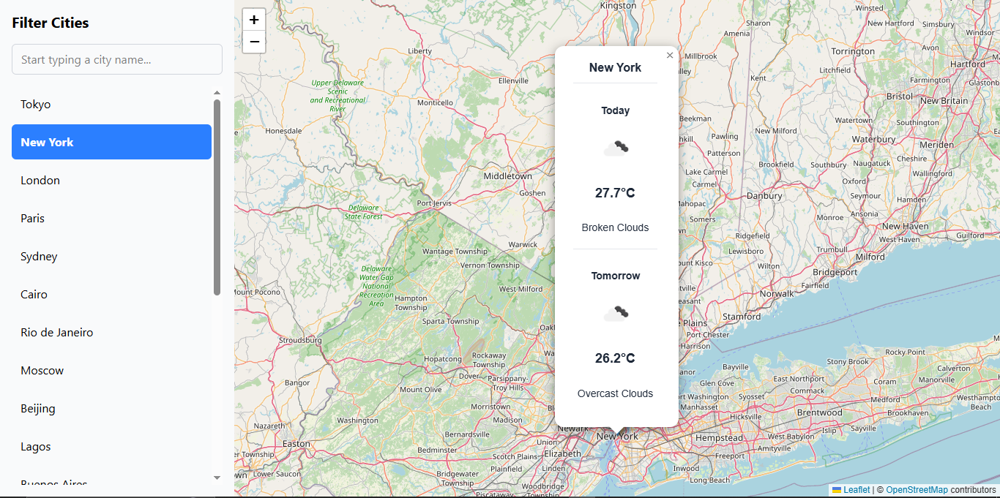

# React Weather Dashboard

A responsive web application that displays weather forecasts for cities around the world on an interactive map. This project was built as a solution to a front-end developer coding challenge.

### [View Live Demo](https://<your-username>.github.io/react-weather-dashboard/)

---


*(**Hint:** Take a screenshot of your finished app and save it as `screenshot.png` in your project's root folder to have it appear here!)*

## About The Project

This application provides a user-friendly interface to check the weather for a predefined list of 20 global cities. It features a responsive design that adapts for optimal viewing on desktop, tablet, and mobile devices. The mobile interface includes a collapsible sidebar and a clean, focused user experience.

## Key Features

* **Interactive Map:** Built with Leaflet, displaying city locations with markers.
* **Live Weather Data:** Fetches and displays current and next-day weather forecasts from the OpenWeatherMap API.
* **Responsive Design:** A seamless experience on all screen sizes, from mobile to desktop.
* **Collapsible Sidebar:** On mobile and tablet views, the sidebar is collapsible to maximize map space.
* **City Search:** A filter allows users to quickly search the list of available cities.

## Technology Stack

This project was built using a modern front-end stack, focusing on performance, developer experience, and best practices.

* **Framework:** [React](https://react.dev/)
* **Build Tool:** [Vite](https://vitejs.dev/)
* **Language:** [TypeScript](https://www.typescriptlang.org/)
* **Styling:** [Tailwind CSS](https://tailwindcss.com/)
* **Mapping:** [Leaflet](https://leafletjs.com/) & [React-Leaflet](https://react-leaflet.js.org/)
* **Icons:** [React Icons](https://react-icons.github.io/react-icons/)
* **API Calls:** [Axios](https://axios-http.com/)

---

### A Note on the Map Provider

This project uses **Leaflet** and **OpenStreetMap** for map rendering.

The initial plan was to use Mapbox, as suggested in the project requirements. However, I encountered an issue during the sign-up process which required credit card information that was not accessible at the time. To ensure development was not blocked, I pivoted to Leaflet, which is a robust, open-source, and highly effective alternative that fulfilled all project requirements without impeding progress. This demonstrates an ability to adapt to technical constraints and find viable solutions.

---

## Setup and Installation

To run this project locally, follow these steps:

1.  **Clone the repository:**
    ```sh
    git clone [https://github.com/](https://github.com/)<your-username>/react-weather-dashboard.git
    ```
2.  **Navigate to the project directory:**
    ```sh
    cd react-weather-dashboard
    ```
3.  **Install dependencies:**
    ```sh
    npm install
    ```
4.  **Create a `.env` file** in the root of the project and add your OpenWeatherMap API key:
    ```
    VITE_OPENWEATHER_API_KEY=your_api_key_here
    ```
5.  **Start the development server:**
    ```sh
    npm run dev
    ```

The application will be available at `http://localhost:5173`.